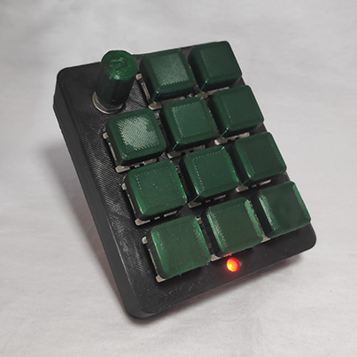
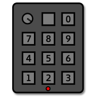
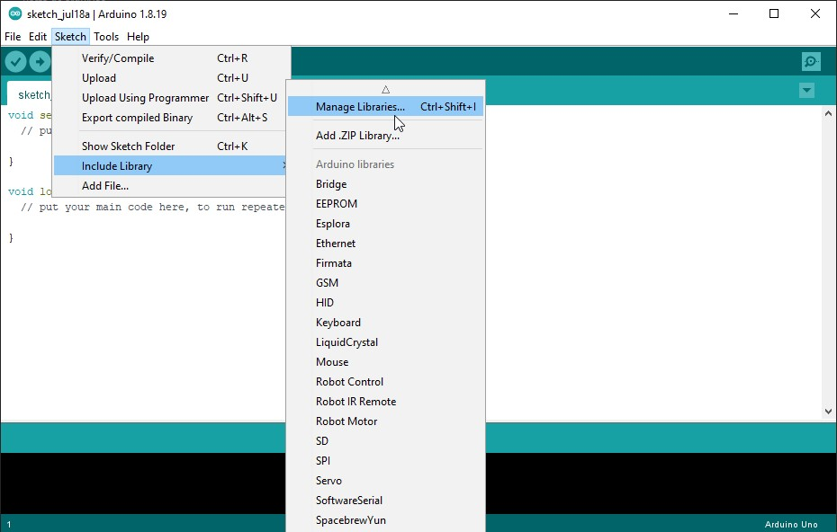
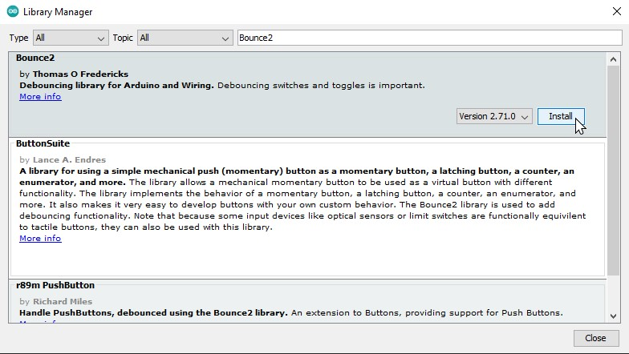
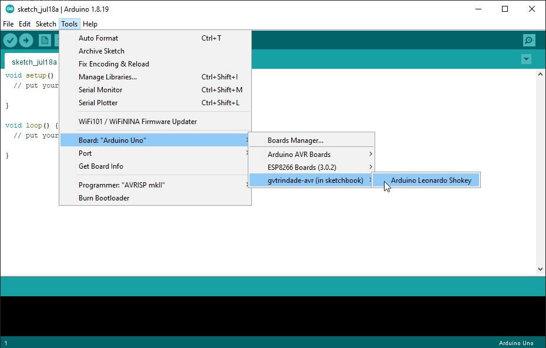
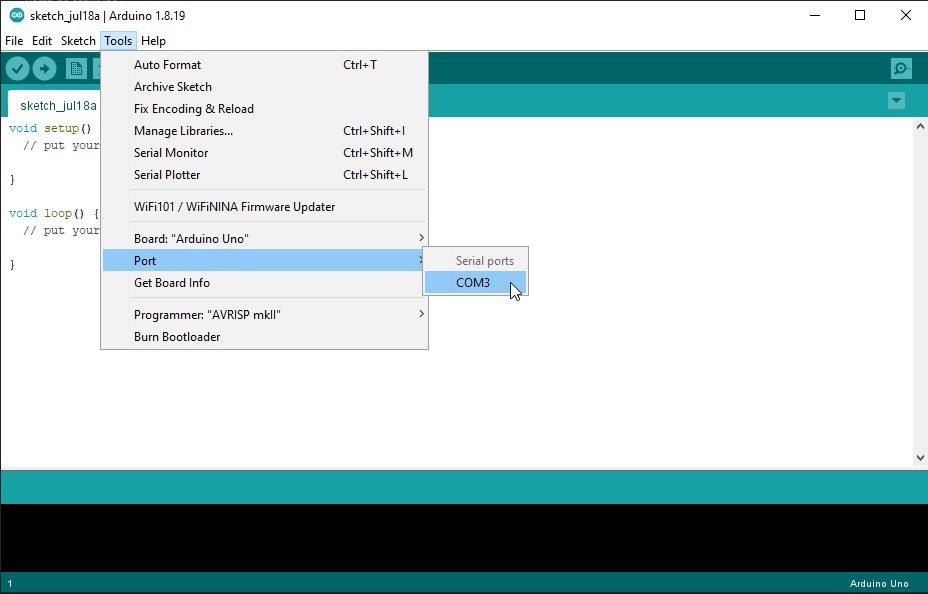
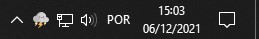
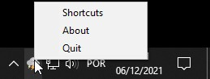
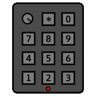
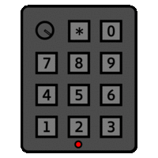

#  Shokey 

An Arduino based Shortcut Keypad and Python app.

 

Table of Contents

  - [Arduino](#arduino)
    - [Features](#features)
    - [Usage](#usage)
    - [Bill of Materials](#bill-of-materials)
    - [Assembling the Hardware](#assembling-the-harrdware)
    - [Flashing the Software](#flashing-the-software)
  - [Python](#python)
    - [Features](#features-1)
    - [Installation](#installation)
    - [Usage](#usage-1)
    - [Shokey Layout](#shokey-layout)
    - [Shortcut Editing](#shortcut-editing)
    - [Custom Keys](#custom-keys)
  - [References](#references)

## ♾ Arduino

The hardware was made using an Arduino Pro Micro, Cherry MX Brown Switches, and 3D printed shell and keycaps.

### Features
- Can be used as a numeric keyboard while not running the app
- Has a cool RGB LED that changes color!

### Usage
To use your Shokey as a numeric keypad, just connect it to your device (PC, Linux, Mac or Android) and start pressing the keys.

    🛒
    Bill of materials

 

- Arduino Pro Micro
- 11 Cherry MX like switches
- 11 Single way diodes
- Rotary Encoder
- RGB LED

    ⚙
    Assembling the hardware

1. [Download](https://thangs.com/designer/gabrielsvtrindade/3d-model/Shokey-199656) and print the shell, keycaps and rotary encoder knob

2. Place all switches and screw in the rotary encoder to the top part of the shell

3. Solder the switches, rotary encoder and RGB LED to their respective pins in the Arduino, following the [wiring diagram](./Images/Wiring_Diagram.png)

4. Close the shell, screw it and glue the rubber feet

    ⚡️
    Flashing the firmware

1. Make sure you have <a target="_blank" href="https://www.arduino.cc/en/software">Arduino IDE</a> installed

2. Go to "Sketch > Include Library > Manage Libraries"

3. Search for and install the Bounce2, Encoder, Keyboard and Keypad libraries

4. [Download](https://github.com/gvtrindade/Shokey/releases) and unzip the **Firmware.zip** file

5. Copy the "hardware" folder to your "Documents/Arduino" folder

6. Go to the "File > Open" folder and navigate to "Firmware/Shokey/Shokey.ino"

7. Go to "Tools > Board > gvtrindade-avr" and select "Arduino Leonardo Shokey"

8. Go to "Tools > Ports" and take note of the ports shown

9. Connect your Shokey, reopen "Tools > Ports" and select the COM port that just appeared

10. Go to "Sketch > Upload"

When the upload is complete, you can already use your Shokey as numeric keypad, but if you want to have the full shortcut experience, you'll have to [install the application](#installation)

 

## 🐍 Python

The app connects to a Shokey and is used for sending and editing the shortcuts

### Features

- Maps keystrokes, key combinations, writes text, opens programs and scroll pages
- Detects automatically whether a Shokey is connected to the PC
- Cute thunderstorm icon

### Installation

1. [Download](https://github.com/gvtrindade/Shokey/releases) and unzip the **Application.zip** file

2. Connect your Shokey

3. Open "Application/Shokey.exe"

### Usage

- While the app is open, there will be a cute thunderstorm icon near our PCs clock
- Double clicking it will open the "shortcuts.txt" file, allowing you to [edit your shortcuts](#shortcut-editing)
- Right clicking it will open a menu to open the Shortcuts file, About file or quit the app:

    🧮
    Shokey Layout

 

Shokey has 4 layers (red, green, blue and white) and the `*` key is used to change between layers

 

The rotary encoder is represented by three variables, `VU` (Volume Up), `VD` (Volume Down) and `E` (Encoder button)

 
    📝
    Shortcut Editing 

 

In the "shortcuts.txt" is where all the magic happens, here is where you write the shortcuts that will be played when you press a key in your Shokey.

The file has 4 sets of lines, 1 for each color.

- To add a shortcut, you'll have to find the key that you want to press, based on the [layout](#shokey_layout), as well as the color and add the shortcut after the `;`.
- After writing the desired shortcut, *save* the file and close it.
- The change will only take effect after the second time the button is pressed.
- Shortcuts will only work if the corretct syntax is used

There are examples of shortcuts in the file, but you can use this list to help you write your own:

- Key shortcut: `key.*key*`
- Combo of keys shortcut: `combo.*key1*+*key2*`
- Write text shortcut: `txt.*text*`
- Open a program shortcut: `link.*full_exe_adress*`
- Scroll the page shortcut: `scroll.*horizontal value*, *vertical Value*`

##### 
    1R; key.a
    2G; combo.alt+f4
    3B; txt.Hello World
    4W; link.C:\Windows\System32\calc.exe
    ER; key.media_play_pause
    VUG; scroll.0,-1
    VDG; scroll.0,1

 
    🏷
    Custom Keys 

 

Some keys are special, the following list has some examples:
#####
    key.media_play_pause    //play and pause control
    key.media_volume_up     //volume up
    key.media_volume_down   //volume down
    combo.ctrl+c            //copy selection

There's a variety of keys
- f2, f5, space, escape, delete, home, end
- ctrl, alt, shift, cmd (windows key)
- up, down, left, right
- <a target="_blank" href="https://pynput.readthedocs.io/en/latest/keyboard.html#pynput.keyboard.Key">More key codes</a>

## 🔎 References
 
- [Programmable Macropad v2 - 
Tiny Boat Productions](https://www.instructables.com/Programmable-Macropad-V2/)
- [MIDI device name - musinou](http://liveelectronics.musinou.net/MIDIdeviceName.php)
- [Bounce2](https://www.arduino.cc/reference/en/libraries/bounce2/), [Encoder](https://www.arduino.cc/reference/en/libraries/encoder/), [Keyboard](https://www.arduino.cc/reference/en/libraries/keyboard/), [Keypad](https://www.arduino.cc/reference/en/libraries/keypad/)
- [Pynput](https://pypi.org/project/pynput/), [Pyserial](https://pypi.org/project/pyserial/), [Systray](https://github.com/Infinidat/infi.systray)
- Icons made by Freepik from flaticon.com
